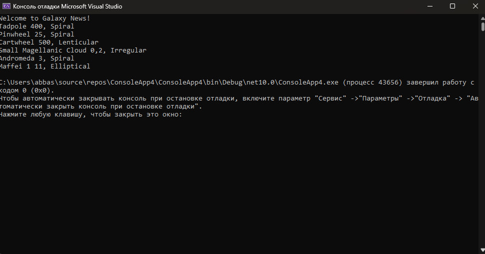

# Отладка приложения «Галактики» (Galaxies)

## Описание
Консольное приложение, выводящее информацию о различных галактиках (название, расстояние, тип).  
В исходном коде было две ошибки: неверный тип свойства и опечатка в switch-конструкторе.

## Исправления
- Изменён тип свойства `GalaxyType` с `object` на `GType`
- Исправлена опечатка в switch: `'l'` → `'I'` (Irregular)
- Добавлены документирующие XML-комментарии

## Способы отладки Microsoft Visual Studio, которые были использованы:

- **Точки останова** в цикле `foreach` и внутри конструктора `GType`
- Пошаговое выполнение (Step Over / Step Into)
- **Data Tips** — просмотр свойств объектов при наведении мыши
- Окна:
  - **Locals**
  - **Watch**
  - **Autos**
- **Горячая перезагрузка** (Hot Reload) при внесении изменений в код
- Просмотр стека вызовов (**Call Stack**)
- Запуск и перезапуск отладчика

## Результат
После исправлений программа корректно выводит название галактики, расстояние в мега-световых годах и её тип (Spiral, Elliptical, Irregular, Lenticular).

