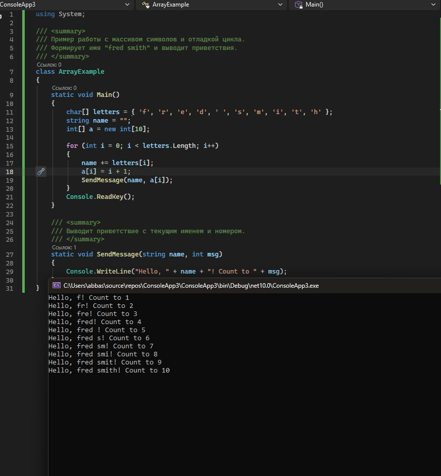

# Отладка приложения «Буквы»

## Описание
Консольное приложение, которое формирует строку из массива символов и выводит приветствия с порядковыми номерами.  
Задача — отладить работу с массивом и вызов метода.

## Исправления и улучшения
- Добавлены документирующие XML-комментарии к классу и методам
- Код приведён в читаемый вид

## Способы отладки Microsoft Visual Studio, которые были использованы:

- Установка **точек останова** внутри цикла `for`
- Пошаговое выполнение:
  - **F10** (Step Over)
  - **F11** (Step Into) — заход в метод `SendMessage`
  - **Shift + F11** (Step Out)
- **Run to Cursor** (выполнить до курсора)
- **Data Tips** — просмотр содержимого массива `letters`, переменной `name` и `i`
- Окна отладки:
  - **Autos**
  - **Locals**
  - **Watch**
- Окно **Call Stack** (стек вызовов)
- Изменение значений переменных во время отладки

## Результат

