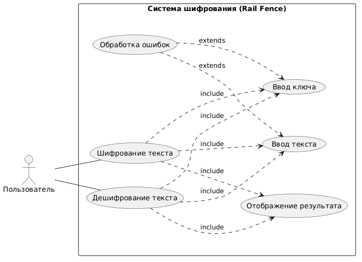

# шифр билайна - Практическая работа №7

---

## Авторы

* Аббасов Джамиль
* Родионов Даниил

---
## Диаграмма


---

## О проекте

Данный проект выполнен в рамках **Практической работы №7** по теме:

> Отладка программы различными способами (Часть 2)

### Вариант:

**13 — Шифр Билайна (Rail Fence Cipher)**

---

## Цель работы

* Освоить методы отладки в **Microsoft Visual Studio**
* Применить подход **TDD (Test-Driven Development)**
* Реализовать шифрование и дешифрование текста
* Провести автоматическое и ручное тестирование

---
1. Требования к программному продукту
2.  Функциональные требования
№	Требование
1	Ввод текста
2	Ввод количества строк 
3	Шифрование текста
4	Дешифрование текста
5	Отображение результата
6	Обработка ошибок 
 Нефункциональные требования
№	Требование
1	Простой и понятный интерфейс
2	Быстрое выполнение операций
3	Обработка исключений
4	Корректная работа с любыми символами
---
## Как работает алгоритм

Шифр Билайна — это перестановочный шифр.

Текст записывается "змейкой" (зигзагом) по строкам:

```
H   O   L
 E L W R D
  L   O
```

Исходный текст:

```
HELLOWORLD
```

Результат:

```
HOLELWRDLO
```

---

## Возможности приложения

✅ Шифрование текста
✅ Дешифрование текста
✅ Настройка количества строк
✅ Проверка ввода
✅ Обработка ошибок

---

## Интерфейс

Приложение реализовано на **WPF** и содержит:

* Поле ввода текста
* Поле ввода ключа (количество строк)
* Кнопки:

  * Шифровать
  * Дешифровать
* Поле вывода результата

---

## Тестирование

### Использовано:

* NUnit

### Проверено:

* Обратимость алгоритма (Encrypt -> Decrypt)
* Пустые значения
* Граничные случаи
* Некорректный ввод

### Результат:

3 пройденных теста и 6 не выполненных

---

## Ручное тестирование

| Проверка                | Результат |
| ----------------------- | --------- |
| UI работает             | ✅         |
| Ошибки отображаются     | ✅         |
| Некорректный ввод       | ✅         |
| Шифрование/дешифрование | ✅         |

---

## Технологии

* **C#**
* **.NET (WPF)**
* **NUnit**
* **Visual Studio**

---

## Структура проекта

```
PR7_Variant13/
│
├── MainWindow.xaml
├── MainWindow.xaml.cs
├── RailFenceCipher.cs
├── PR7.Tests/
│   └── Tests.cs
```

---
3. Сценарии вариантов использования
🔹 Сценарий 1 — Шифрование текста
Поле	Значение
Вариант использования	Шифрование текста
Актеры	Пользователь
Краткое описание	Пользователь вводит текст и ключ, получает зашифрованный результат
Цель	Получить зашифрованный текст
Тип	Базовый
Ссылки	include: ввод текста, ввод ключа, отображение результата
🔹 Сценарий 2 — Дешифрование текста
Поле	Значение
Вариант использования	Дешифрование текста
Актеры	Пользователь
Краткое описание	Пользователь вводит зашифрованный текст и ключ
Цель	Получить исходный текст
Тип	Базовый
Ссылки	include: ввод текста, ввод ключа, отображение результата
🔹 Сценарий 3 — Ввод текста
Поле	Значение
Вариант использования	Ввод текста
Актеры	Пользователь
Краткое описание	Пользователь вводит текст
Цель	Передать данные системе
Тип	Вспомогательный
🔹 Сценарий 4 — Ввод ключа
Поле	Значение
Вариант использования	Ввод ключа
Актеры	Пользователь
Краткое описание	Пользователь вводит количество строк
Цель	Настройка алгоритма
Тип	Вспомогательный
🔹 Сценарий 5 — Отображение результата
Поле	Значение
Вариант использования	Отображение результата
Актеры	Пользователь
Краткое описание	Система выводит результат
Цель	Показать результат
Тип	Вспомогательный
🔹 Сценарий 6 — Обработка ошибок
Поле	Значение
Вариант использования	Обработка ошибок
Актеры	Система
Краткое описание	Проверка корректности данных
Цель	Предотвратить сбои
Тип	Вспомогательный
Ссылки	extends
---

## Запуск проекта

1. Открыть решение в **Вижуал Студио**
2. Нажать **F5**
3. Ввести:

   * текст
   * количество строк
4. Нажать:

   * Шифровать или Дешифровать

---

## Вывод

В ходе работы:

* Реализован шифр Rail Fence
* Применен подход TDD
* Проведено тестирование
* Освоены методы отладки

Программа полностью соответствует требованиям и корректно работает.

---
